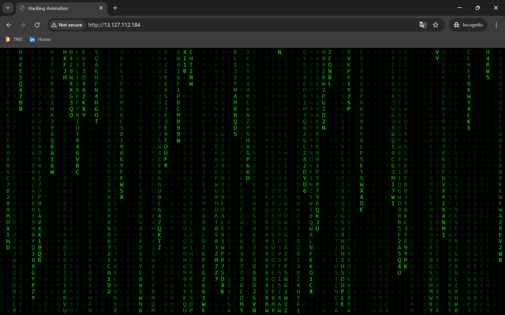

# CI/CD Pipeline Setup Using Jenkins, Ansible, and Apache Web Server

---

# Step 1: Launch Four Instances

1. Jenkins  
2. Ansible  
3. Web-Server  
4. Developer  

---

# Ansible Server Configuration

## Step 2: Install Ansible
```bash
sudo apt update
sudo apt install software-properties-common -y
sudo add-apt-repository --yes --update ppa:ansible/ansible
sudo apt install ansible -y
```

## Step 3: Set Root User Password
```bash
passwd root
```

## Step 4: Generate SSH Key Pair
```bash
ssh-keygen
```

## Step 5: Enable SSH Root Login
```bash
sudo nano /etc/ssh/sshd_config
```
Update/Add these lines:
```bash
PermitRootLogin yes
PasswordAuthentication yes
```
```bash
sudo nano /etc/ssh/sshd_config.d/10-cloud-init.conf
```
Add:
```bash
PermitRootLogin yes
PasswordAuthentication yes
```

## Step 6: Restart SSH Service & Verify Configuration
```bash
sudo systemctl restart ssh
sudo sshd -T | grep -Ei 'passwordauthentication|permitrootlogin'
```

---

# Jenkins Server Configuration

## Step 7: Create Jenkins Install Script
```bash
nano jenkins.sh
```

Paste the following content:
```bash
#!/bin/bash

set -e

echo "Updating system packages..."
sudo apt update && sudo apt upgrade -y

echo "Installing Java (OpenJDK 17)..."
sudo apt install openjdk-17-jdk -y

echo "Adding Jenkins GPG key..."
curl -fsSL https://pkg.jenkins.io/debian-stable/jenkins.io-2023.key | sudo tee /usr/share/keyrings/jenkins-keyring.asc > /dev/null

echo "Adding Jenkins repository..."
echo deb [signed-by=/usr/share/keyrings/jenkins-keyring.asc] https://pkg.jenkins.io/debian-stable binary/ | sudo tee /etc/apt/sources.list.d/jenkins.list > /dev/null

echo "Updating package list with Jenkins repo..."
sudo apt update

echo "Installing Jenkins..."
sudo apt install jenkins -y

echo "Starting and enabling Jenkins service..."
sudo systemctl start jenkins
sudo systemctl enable jenkins

echo "Allowing firewall on port 8080 (if UFW is active)..."
sudo ufw allow 8080 || true
sudo ufw reload || true

echo "Jenkins installation completed!"
echo "Access Jenkins via: http://<your-server-ip>:8080"
echo "Initial admin password:"
sudo cat /var/lib/jenkins/secrets/initialAdminPassword
```

## Step 8: Make the Script Executable
```bash
chmod +x jenkins.sh
```

## Step 9: Run the Script
```bash
sudo ./jenkins.sh
```

## Step 10 to 13: Root Password & SSH Login (Repeat Same Steps as Ansible)
```bash
passwd root
ssh-keygen
sudo nano /etc/ssh/sshd_config
```
Update:
```bash
PermitRootLogin yes
PasswordAuthentication yes
```
```bash
sudo nano /etc/ssh/sshd_config.d/10-cloud-init.conf
```
Add:
```bash
PermitRootLogin yes
PasswordAuthentication yes
```
```bash
sudo systemctl restart ssh
sudo sshd -T | grep -Ei 'passwordauthentication|permitrootlogin'
```

---

# Web Server Configuration

## Step 14: Install Apache
```bash
apt install apache2
```

## Step 15 to 18: Root Password & SSH Config
```bash
passwd root
ssh-keygen
sudo nano /etc/ssh/sshd_config
```
Update:
```bash
PermitRootLogin yes
PasswordAuthentication yes
```
```bash
sudo nano /etc/ssh/sshd_config.d/10-cloud-init.conf
```
Add:
```bash
PermitRootLogin yes
PasswordAuthentication yes
```
```bash
sudo systemctl restart ssh
sudo sshd -T | grep -Ei 'passwordauthentication|permitrootlogin'
```

---

# SSH Authentication Setup

## Step 19: Jenkins → Ansible SSH Key Auth
```bash
ssh-copy-id root@<ansible_private_ip>
ssh root@<ansible_private_ip>
```

## Step 20: Ansible → Web Server SSH Key Auth
```bash
ssh-copy-id root@<web-server_private_ip>
ssh root@<web-server_private_ip>
```

---

# Ansible Project Setup

## Step 21: Create Project Directory
```bash
mkdir -p /home/ubuntu/sourcecode
cd /home/ubuntu/sourcecode
```

## Step 22: Define Web Server in Ansible Inventory
```bash
nano hosts
```
Add:
```ini
[webserver]
<web-server-private-ip> ansible_user=root
```

## Step 23: Ansible Playbook for Deployment
```bash
nano playbook.yml
```
Add:
```yaml
- name: Deploy index.html to webserver
  hosts: webserver
  become: yes
  tasks:
    - name: Copy index.html to web root
      copy:
        src: /opt/index.html
        dest: /var/www/html/index.html
```

---

# Jenkins Configuration

## Step 24: Create Jenkins API Token

- Go to: **Dashboard > Your Username > Configure**  
- Generate and save new token under **API Token**

## Step 25: GitHub Webhook Setup

- Go to: **GitHub Repo > Settings > Webhooks > Add Webhook**  
Payload URL:
```bash
http://<jenkins_ip>:8080/github-webhook/
```
Content type: `application/json`  
Save.

## Step 26: Install Plugin and SSH Remote Hosts

- Manage Jenkins > Plugin Manager > Install **Publish Over SSH**

Configure remote hosts:
```
Jenkins:
- Name: Jenkins
- Hostname: <jenkins_private_ip>
- Username: root

Ansible:
- Name: Ansible
- Hostname: <ansible_private_ip>
- Username: root
```

---

# Jenkins Freestyle Job

## Step 27: Create Jenkins Freestyle Project

- **Source Code Management**:
```bash
Git Repository: https://github.com/your/repo.git
Branch: main
```

- **Build Trigger**:
```bash
Check: GitHub hook trigger for GITScm polling
```

- **Build Step 1**: Send File to Ansible
```bash
rsync -avh /var/lib/jenkins/workspace/<project_name>/index.html root@<ansible_ip>:/opt/
```

- **Build Step 2**: Trigger Ansible Playbook
```bash
ansible-playbook -i /home/ubuntu/sourcecode/hosts /home/ubuntu/sourcecode/playbook.yml
```

---

# Step 28: Access Deployed Web Page

Open in browser:
```bash
http://<web-server-ip>

```
